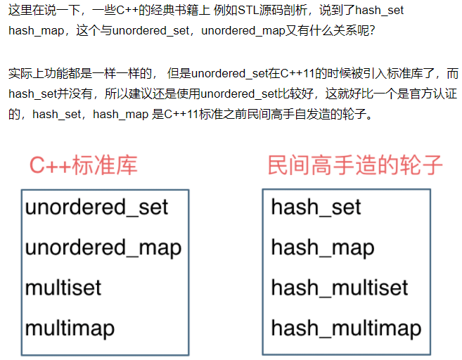
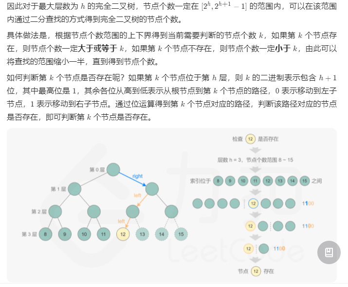
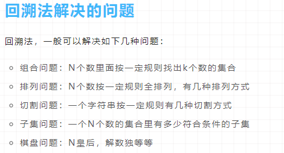
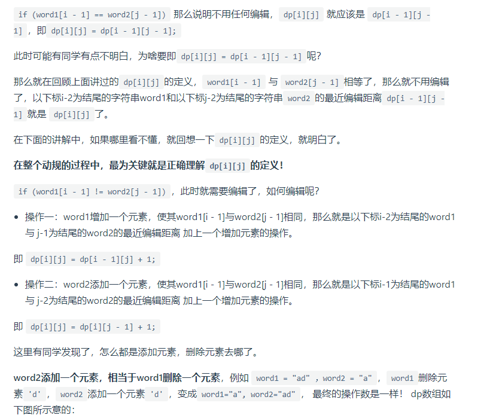
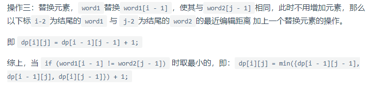
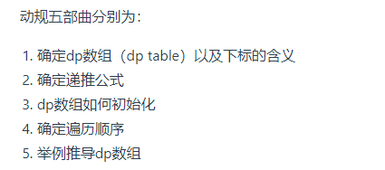
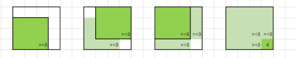

# 力扣刷题题解及分析

## 2 不等长链表之和

> 链表
>
> > 不等长链表在同时计算时，之前都是用**两方共同长度的循环**+**各自单独到尾的循环**
> >
> > 在此算法题解中采用了一种高效的方法
> >
> > > 取两者的**最大长度**进行循环，如果其中一方提前结束（到达尾结点）
> > >
> > > 则将此链表所对应的临时变量取为节点数据类型的零元素
> > >
> > > 具体程序如下
> > >
> > > ```c++
> > > ListNode* addTwoNumbers(ListNode* l1, ListNode* l2) {
> > >         ListNode *head = nullptr, *tail = nullptr;
> > >         int carry = 0;
> > >         while (l1 || l2) {
> > >             int n1 = l1 ? l1->val: 0;
> > >             int n2 = l2 ? l2->val: 0;
> > >             int sum = n1 + n2 + carry;
> > >             if (!head) {
> > >                 head = tail = new ListNode(sum % 10);
> > >             } else {
> > >                 tail->next = new ListNode(sum % 10);
> > >                 tail = tail->next;
> > >             }
> > >             carry = sum / 10;
> > >             if (l1) {
> > >                 l1 = l1->next;
> > >             }
> > >             if (l2) {
> > >                 l2 = l2->next;
> > >             }
> > >         }
> > >         if (carry > 0) {
> > >             tail->next = new ListNode(carry);
> > >         }
> > >         return head;
> > >     }
> > > ```
> > >
> > > 

## 3 无重复字符的最大长度

滑动窗口是比较好的选择

> 从第一个字符开始有光标逐次向右移动
>
> 如果有重复则向右移动做光标
>
> > 删除做光标代指的字符
> >
> > 这里用到unorder_set 来存储已经在光标内的字符，并可以进行检查是否包括将要新加入的

```c++
int lengthOfLongestSubstring(string s) {
    int rightCur=-1,maxLen=0, reNum;
    int sLen = s.size();
    unordered_set<char> strSet;
    for(int leftCur=0;leftCur<sLen-maxLen;leftCur++){
        if(leftCur != 0)
            strSet.erase(s[leftCur-1]); // 从左侧开始删，以删掉跟右边重复的那个
        while (rightCur+1<sLen && !strSet.count(s[rightCur+1])){
            strSet.insert(s[++rightCur]);
        }
        maxLen = max(maxLen,rightCur-leftCur+1);
    }
}
```

## 4 两个数组中位数

和第二题做法基本一样，需要定义一个很大的数（10^9及以上作为数据末尾的标志）

## 5 最长回文子串

我的做法：将相同字符的下标放入map<char, vector<int>>中，然后验证每个vector中每种数对组合，从两边向中心收缩

```c++
string solution(string s)
{
    map<char, vector<int>> smap;
    int ibegin=0, iend=0, longest=0;
    int slen = s.size();
    if (slen<=1)
        return s;
    for (int i=0;i<slen;i++){
        if (smap.find(s[i]) == smap.end())
            smap[s[i]] = vector<int>{i};
        else
            smap[s[i]].push_back(i);
    }
    for (auto smapIter = smap.begin();smapIter!=smap.end();smapIter++){
        if (smapIter->second.size()>1){
            for (int i=0;i<smapIter->second.size()-1;i++){
                for (int j=smapIter->second.size()-i-1;j>i;--j){
                    int vecBeing=smapIter->second[i], vecEnd=smapIter->second[i+j];
                    int equalFlag=1;
                    while (vecBeing<=vecEnd){
                        if (s[vecBeing]!=s[vecEnd]){
                            equalFlag=0;
                            break;
                        }
                        else{
                            ++vecBeing;
                            --vecEnd;
                        }
                    }
                    if (equalFlag==1 && smapIter->second[i+j]-smapIter->second[i]+1 > longest){
                        longest = smapIter->second[i+j]-smapIter->second[i]+1;
                        ibegin = smapIter->second[i];
                        iend = smapIter->second[i+j];
                    }
                }
            }
        }
    }
    string str;
    for (;ibegin<=iend;++ibegin)
        str += s[ibegin];
    return str;
}
```

比较好的：中心扩展验证方法（分为单数回文串和双数回文串两种情况）比两边收缩的方法时间复杂度小了很多。

```c++
pair<int, int> expandAroundCenter(const string& s, int left, int right) {
    while (left >= 0 && right < s.size() && s[left] == s[right]) {
        --left;
        ++right;
    }
    return {left + 1, right - 1};
}
//
string longestPalindrome(string s) {
    int start = 0, end = 0;
    for (int i = 0; i < s.size(); ++i) {
        auto [left1, right1] = expandAroundCenter(s, i, i); // 单数回文串最大
        auto [left2, right2] = expandAroundCenter(s, i, i + 1); // 双数回文串最大
        // 计算字符串的起止位置。
        if (right1 - left1 > end - start) {
            start = left1;
            end = right1;
        }
        if (right2 - left2 > end - start) {
            start = left2;
            end = right2;
        }
    }
    return s.substr(start, end - start + 1);
}
```


## 7 整数翻转

通过 x/10依次向右递减，这样就不用存弹出来的数

```c++
class Solution {
public:
    int reverse(int x) {
        int rev = 0;
        while (x != 0) {
            int pop = x % 10;
            x /= 10;
            if (rev > INT_MAX/10 || (rev == INT_MAX / 10 && pop > 7)) return 0;
            if (rev < INT_MIN/10 || (rev == INT_MIN / 10 && pop < -8)) return 0;
            rev = rev * 10 + pop;
        }
        return rev;
    }
};


```

INT_MAX、INT_MIN是C++定义的整型最大最小数，方便很多。

## 69 求解向左整数平方根

*num*/mid > mid

二分法，只能用除法求解，防止数据溢出。

## 367 验证是否是平方数

n^2 = 1 + 3 +5 + 7 +.......

## 206 反转链表

直接让next指针指向前一个

## 19 删除链表的倒数第n个节点

先让一个节点向前n步，然后另一个节点从头和这个节点一块动，当第一个节点到达末尾的时候，第二个就是倒数第n个

## 0207 寻找公共链表段

先遍历获得两个链表的长度，然后长的一个缩进以保持长度相同，然后逐个对比是否相等。

## 142 环形起始点

快慢指针不止是提前多少个位置，还可以是倍速的n倍。

## 242 有效的字母异位词

哈希表就是把关键字直接映射为数组下标

| 集合               | 底层实现 | 是否有序 | 数值是否可以重复 | 能否更改数值 | 查询效率 | 增删效率 |
| :----------------- | :------- | :------- | :--------------- | :----------- | :------- | :------- |
| std::set           | 红黑树   | 有序     | 否               | 否           | O(logn)  | O(logn)  |
| std::multiset      | 红黑树   | 有序     | 是               | 否           | O(logn)  | O(logn)  |
| std::unordered_set | 哈希表   | 无序     | 否               | 否           | O(1)     | O(1)     |

| 映射               | 底层实现 | 是否有序 | 数值是否可以重复 | 能否更改数值 | 查询效率 | 增删效率 |
| :----------------- | :------- | :------- | :--------------- | :----------- | :------- | :------- |
| std::map           | 红黑树   | key有序  | key不可重复      | key不可修改  | O(logn)  | O(logn)  |
| std::multimap      | 红黑树   | key有序  | key可重复        | key不可修改  | O(logn)  | O(logn)  |
| std::unordered_map | 哈希表   | key无序  | key不可重复      | key不可修改  | O(1)     | O(1)     |



##  15 三数之和

不管用什么方法，先进行排序。排序之后可以尽可能降低重复

感觉官方的哈希表的方法也很麻烦，判断条件过多。

### 双指针法，减少需要的空间

这里用了三个指针，第一个指针控制大循环，后两个指针逐渐接近

```c
class Solution {
public:
    vector<vector<int>> threeSum(vector<int>& nums) {
        vector<vector<int>> result;
        sort(nums.begin(), nums.end());
        // 找出a + b + c = 0
        // a = nums[i], b = nums[left], c = nums[right]
        for (int i = 0; i < nums.size(); i++) {
            // 排序之后如果第一个元素已经大于零，那么无论如何组合都不可能凑成三元组，直接返回结果就可以了
            if (nums[i] > 0) {
                return result;
            }
            // 错误去重方法，将会漏掉-1,-1,2 这种情况
            /*
            if (nums[i] == nums[i + 1]) {
                continue;
            }
            */
            // 正确去重方法
            if (i > 0 && nums[i] == nums[i - 1]) {
                continue;
            }
            int left = i + 1;
            int right = nums.size() - 1;
            while (right > left) {
                // 去重复逻辑如果放在这里，0，0，0 的情况，可能直接导致 right<=left 了，从而漏掉了 0,0,0 这种三元组
                /*
                while (right > left && nums[right] == nums[right - 1]) right--;
                while (right > left && nums[left] == nums[left + 1]) left++;
                */
                if (nums[i] + nums[left] + nums[right] > 0) {
                    right--;
                } else if (nums[i] + nums[left] + nums[right] < 0) {
                    left++;
                } else {
                    result.push_back(vector<int>{nums[i], nums[left], nums[right]});
                    // 去重逻辑应该放在找到一个三元组之后
                    while (right > left && nums[right] == nums[right - 1]) right--;
                    while (right > left && nums[left] == nums[left + 1]) left++;

                    // 找到答案时，双指针同时收缩
                    right--;
                    left++;
                }
            }

        }
        return result;
    }
};
```

这里他还有一个判断与0的关系然后判断哪个指针进行移动的问题，很有效

## 28 实现strStr()（KMP算法）

通过KMP算法求得next数组，然后在求解

```c++
class Solution {
public:
    void getNext(int* next, const string& s) {
        int j = -1;
        next[0] = j;
        for(int i = 1; i < s.size(); i++) { // 注意i从1开始
            // 这里是和j+1做的比较，所以下一步会比较next[j]+1和i所对应的值的关系
            while (j >= 0 && s[i] != s[j + 1]) { // 前后缀不相同了
                j = next[j]; // 向前回退
            }
            // 这里也是和j+1比较，有可能这里的j为-1，然后如果不相等的话就是完全错过这一段
            if (s[i] == s[j + 1]) { // 找到相同的前后缀
                j++;
            }
            next[i] = j; // 将j（前缀的长度）赋给next[i]
        }
    }
    int strStr(string haystack, string needle) {
        if (needle.size() == 0) {
            return 0;
        }
        int next[needle.size()];
        getNext(next, needle);
        int j = -1; // // 因为next数组里记录的起始位置为-1
        for (int i = 0; i < haystack.size(); i++) { // 注意i就从0开始
            while(j >= 0 && haystack[i] != needle[j + 1]) { // 不匹配
                j = next[j]; // j 寻找之前匹配的位置
            }
            if (haystack[i] == needle[j + 1]) { // 匹配，j和i同时向后移动
                j++; // i的增加在for循环里
            }
            if (j == (needle.size() - 1) ) { // 文本串s里出现了模式串t
                return (i - needle.size() + 1);
            }
        }
        return -1;
    }
};

```

## 347 出现频率最高的前k个元素（STL中的优先级队列）

使用优先级队列（大根堆、小根堆）

小于号是大根堆，大于号是小根堆

```c++
priority_queue<Type, Container, Functional>;
// type是元素类型，container指明容器类型，functional指明自定义的比较函数
// 默认是大根堆
// 比较函数用一个类重定义"()"实现
// 使用自己的比较函数时，如果是a<b,则是大根堆，a>b则是小根堆
```

## 144 二叉树前序输出

## 222 二叉树节点个数

不用递归遍历的前提下，用二分法找最后一层的最后一个节点



完全二叉树的序号和其根节点到当前节点的左右遍历顺序有关（从序号的二进制判断）

## 700 二叉搜索树问题

左侧的值都小于跟节点，右侧的值都大于根节点

## 98 二叉搜索树的中序遍历是升序的（重要性质）

用此条件来判断是否是搜索树

## 501 morris遍历二叉树

## 450 删除时需要考虑被删除节点有几个子节点

如果有两个的话找到后继节点替换，然后删除后继节点

后继节点最多有一个子节点

然后可以把这部分情况合并


# 回溯法



回溯问题都可以抽象为属性结构

##  135双向遍历找最小和

这个很值得一看

##  背包问题的动态数组

数组的两个维度分别表示为物品和剩余重量

数组值为在当前的物品和剩余重量下，能够获取到的最大价值

### 一维数组解决背包问题

只能在内层遍历背包容量，外层遍历物品，**且背包容量只能倒叙遍历，否则会重复放置同一个物品**

如果在外层倒序遍历背包容量，那么之前的容量都为0，无法达到动态规划的效果

## 494 这个目标和的题目非常经典

## 01背包和完全背包的区别就是

同一个元素是否可以重复使用

## 300 最大上升序列（这个题很重要，主要是dp的记录的内容比较难想）

```c++
// dp[i]表示i之前包括i的最长上升子序列
// 这个要包括当前i的特点的对于这个方法很重要
// 没有想到这个方法就是这里被约束了
// 而且对每一个子序列分别进行找最大子序列的操作
// 因为比较的时候比如dp[j],最后一个元素肯定是nums[j],所以直接和他比较就可以了
int lengthOfLIS(vector<int>& nums) {
    int result = 0, n = nums.size();
    vector<int> dp(n, 1); // 最少应该都包括自身
    for(int i=1;i<n;++i){
        for(int j=0;j<i;++j){
            if(nums[i]>nums[j]) nums[i] = max(nums[i], nums[j]+1);
        }
        // 记录曾经出现过的最大值
        if(result<nums[i]) result = nums[i];
    }
    return result;
}
```

## 718 1143 连续子串和公共子序列（不用连续）的区别

一定要区分用dp时的区别是什么

## 72 编辑距离







## 739 单调栈 每日温度

单调栈：一维数组虚招一个元素的右边或者第一个比自己大或者小的元素，用单调栈

```c++
// 单调栈的做法解读
int largestRectangleArea(vector<int>& heights) {
    stack<int> st;
    heights.insert(heights.begin(), 0); // 数组头部加入元素0，这样保证st中始终都有元素
    heights.push_back(0); // 数组尾部加入元素0，尾部加入0可以计算所有可能性，不会导致最后st中有剩余
    st.push(0);
    int result = 0;
    // 第一个元素已经入栈，从下表1开始
    for (int i = 1; i < heights.size(); i++) {
        // 注意heights[i] 是和heights[st.top()] 比较 ，st.top()是下表
        if (heights[i] > heights[st.top()]) {
            st.push(i);
        } else if (heights[i] == heights[st.top()]) { // 这里遇到相同的弹出，所以记录的是相邻出现的元素的最后一个出现的位置
            st.pop(); // 这个可以加，可以不加，效果一样，思路不同
            st.push(i);
        } else {
            while (heights[i] < heights[st.top()]) { // 注意是while
                int mid = st.top();
                st.pop();
                int left = st.top(); // 前边还有一个0，最少也是从头开始
                int right = i;
                int w = right - left - 1; // 这里其实就是当前堆栈顶部元素的个数
                int h = heights[mid];
                result = max(result, w * h);
            }
            st.push(i);
        }
    }
    return result;
}
```

## 32 最长有效括号

用堆栈和动态规划做比较方便

但是做法比较难想

堆栈为了能够将符合要求的字符列连在一起，在栈顶存的是上一个不被匹配的右括号

动态规划往回推导比较难

## 148 排序链表

最适合链表排序的方法是归并排序

这个自底向上的链表排序方法很重要

```c++
ListNode* mergeTwoLists(ListNode* l1, ListNode* l2) {
    if(!l1) return l2;
    else if(!l2) return l1;

    ListNode *result, *current = new ListNode(-1);
    result=current;
    while(l1 && l2) { // 其中一个为空后就不用合并了
        if(!l1 || (l2 && l1->val >= l2->val)){
            current->next=l2;
            l2=l2->next;
            current=current->next;
        } else {
            current->next=l1;
            l1=l1->next;
            current=current->next;
        }
    }
    current->next = l1==nullptr?l2:l1;
    return result->next;
}

ListNode* sortList(ListNode* head) {
    ListNode *prev = new ListNode(0, head), *cur=prev;
    int len=0;
    while(cur->next!=nullptr){
        cur=cur->next;
        ++len;
    }
    int subLen=1;
    cur=prev->next;
    while(subLen<len){
        ListNode *preHead=prev, *cur=preHead->next;
        while(cur!=nullptr){
            ListNode *first = cur;
            for(int i=1;i<subLen && cur->next!=nullptr;++i)
                cur=cur->next;
            ListNode *second = cur->next;
            cur->next=nullptr;
            cur=second;
            for(int i=1;i<subLen  && cur!=nullptr;++i)
                cur=cur->next;

            ListNode *next= nullptr;
            if(cur!=nullptr){
                next=cur->next;
                cur->next=nullptr;
            }
            ListNode *merge=mergeTwoLists(first, second);
            preHead->next=merge;
            while(preHead->next!=nullptr)
                preHead=preHead->next;
            cur=next;
        }
        subLen*=2;
    }
    return prev->next;
}
```


## 1109 航班预订统计

差分数组的性质是，当我们希望对原数组的某一个区间 [l,r][l,r] 施加一个增量inc 时，差分数组 d 对应的改变是：d[l] 增加 inc，d[r+1] 减少 inc。

## 1277 最大正方形



## 287 寻找重复数

对空间复杂度的严格要求

二分法是根据不断的循环，查找值中点左右的数的个数，进而进一步判断重复数字

## 301 删除无效的括号

我是上来直接回溯，能做出来，但是时间复杂度太高

官方是先统计需要删除的左括号和右括号，然后用这两个数量去做递归

## 滑动窗口最大值

这个题很经典，用双端队列实现
